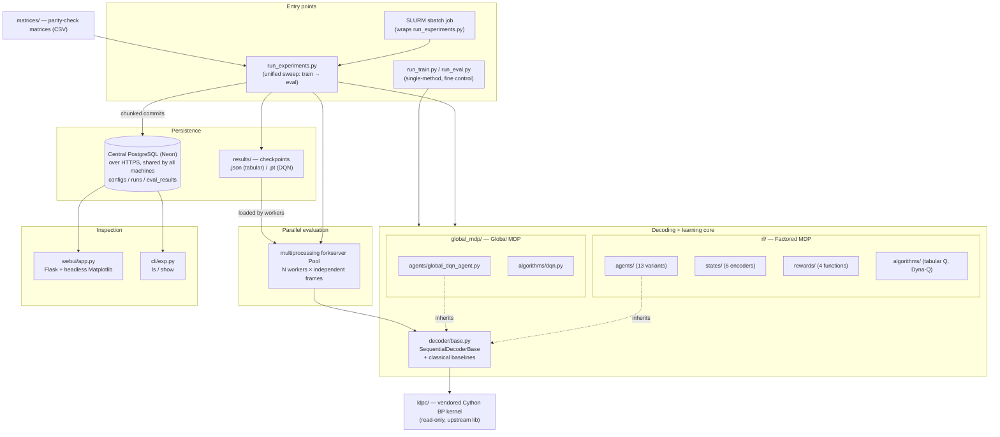
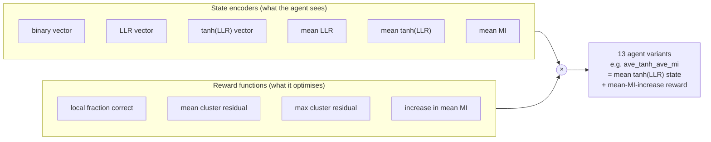
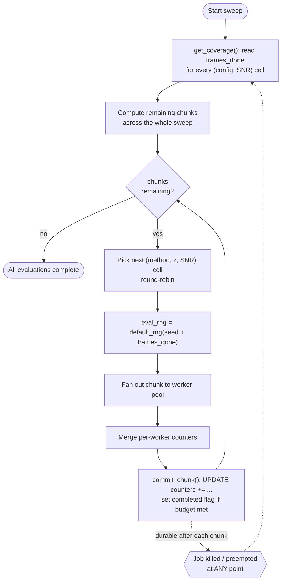

# Design Document — RL-Scheduled LDPC Decoder Research Platform

> Audience note: this document is written for a general ML/software engineering reader.
> The reinforcement-learning specifics are kept shallow on purpose — the interesting
> engineering here is the **experiment platform**, not the RL algorithm.

---

## 1. Problem statement

### 1.1 The domain in one paragraph

An LDPC code is an error-correcting code defined by a sparse binary parity-check matrix
`H` of shape `(m, n)`. Decoding is done by **belief propagation (BP)** on a bipartite
graph: `n` *variable nodes* (VNs, one per received bit) and `m` *check nodes* (CNs, one
per parity constraint). Each node passes "belief" messages (log-likelihood ratios, LLRs)
to its neighbours, repeatedly, until the parity checks are satisfied or an iteration
budget runs out.

The standard schedule is **flooding**: every check node updates simultaneously, every
iteration. This is simple but wasteful — many check nodes are already satisfied and
contribute nothing, yet still cost messages.

### 1.2 The research question

> *Can we learn a **scheduling policy** — which group of check nodes to update next —
> that reaches the same error rate using fewer messages than flooding?*

This is naturally a sequential decision problem, so it is framed as RL. The **agent**
observes the current belief state of the graph, **acts** by choosing a cluster of check
nodes to update, and is **rewarded** for making the beliefs more confident/correct.

### 1.3 What the system actually has to do

The science is a small part of the work. The engineering requirement is:

| Requirement | Why it is hard |
|---|---|
| Compare ~15 methods × several cluster sizes × ~5 SNR points | Combinatorial explosion of runs |
| Measure bit error rates down to `1e-5`–`1e-6` | Monte Carlo: needs **millions** of decoded frames |
| Run on a shared HPC cluster (SLURM) | Jobs get preempted, walltime-killed, queued for hours |
| Never silently report a wrong number | It's research; a wrong plot is worse than a crash |
| Let a human see partial results *while* the sweep runs | Sweeps take days |

**The core insight that shaped the whole design:** measuring a BER of `1e-5` needs on the
order of `10^6`–`10^7` simulated frames per data point. That is hours-to-days of compute
per curve, on a cluster where a job can vanish at any moment. So the system is designed
around one central property — **every unit of work is idempotent, checkpointed, and
resumable** — and around one central performance property — **frame simulation is
embarrassingly parallel**.

---

## 2. System overview



### 2.1 Module responsibilities

| Module | Responsibility |
|---|---|
| `ldpc/` | Vendored third-party Cython BP kernel. Treated as read-only. |
| `rl/decoder/base.py` | Adapter that turns the batch BP kernel into a **single-check-node stepper**. Also the shared base class for every scheduler. |
| `rl/decoder/{flooding,sequential,rbl,ave_rbl,max_rbl}.py` | Classical non-learned baselines (flooding, round-robin, random, residual-BP family). |
| `rl/states/`, `rl/rewards/` | Pluggable state encoders and reward functions — the two axes of the research sweep. |
| `rl/agents/` | Learned schedulers, each a thin composition of (state encoder × reward function). |
| `rl/algorithms/` | The learning rule itself (tabular Q-learning, Dyna-Q). |
| `global_mdp/` | Separate, deliberately non-shared DQN formulation. |
| `rl/decoder/engine.py` | The parallel Monte-Carlo evaluation engine. |
| `expdb/` | Experiment tracking: config hashing, run records, incremental eval accumulation. |
| `webui/`, `cli/` | Read-only views over the database. |

---

## 3. Design decisions

Each decision below is stated as **Decision → Alternatives considered → Justification**.
Section 4 separately lists decisions I consider *weak* and would change.

---

### D1. Wrap the vendored BP kernel; do not reimplement BP

**Decision.** `SequentialDecoderBase` (`rl/decoder/base.py`) wraps the third-party
Cython `BpDecoder` in `schedule="cluster"` mode and exposes exactly two primitives:

```python
_init_decode(llr_channel) -> (llr_post, x_hat)   # reset + seed from channel
_schedule_cn(cn, llr_post, x_hat) -> llr_post    # update ONE check node
```

Every scheduler — learned or classical — is then just a policy for *which `cn` to call
`_schedule_cn` on next*.

**Alternatives.** (a) Write BP in NumPy. (b) Fork and modify the Cython library.

**Justification.**
- BP is the innermost hot loop, executed billions of times across a sweep. A pure-Python
  implementation would have made the target BER measurements computationally infeasible.
- The upstream kernel is numerically validated by its community; reimplementing it would
  have introduced a correctness risk in the one component that must be beyond suspicion.
- Confining all library contact to a ~70-line adapter means the entire rest of the
  codebase is pure Python/NumPy and testable without the extension.
- It cleanly separates *the physics* (message passing, fixed) from *the research
  variable* (the schedule).

---

### D2. Composition over inheritance for agent variants — the "plugin matrix"

**Decision.** The research question is really "which **observation** paired with which
**reward** yields the best scheduler?" So state encoders and reward functions are
independent, interchangeable objects, and each agent is a one-per-cluster list of each:

```python
self.state_encoders = [LocalAveTanhLLRState(nb, discretize=True) for nb in neighborhoods]
self.reward_fns     = [IncreaseAveMIClusterReward(nb)            for nb in neighborhoods]
```

A new agent variant is ~12 lines — subclass the base agent, swap those two lists.



The method naming convention is literally `<state>_<reward>`, so `ave_tanh_ave_mi`
is self-documenting, and the CLI method string, the checkpoint filename, and the database
config key are all the same token.

**Alternatives.** One monolithic agent with `if state_type == ...` branches; or a deep
inheritance tree with one class per combination.

**Justification.**
- The sweep space is a Cartesian product; the code structure mirrors it, so adding one
  state encoder yields four new comparable methods for free.
- Encoders and rewards are pure functions of the LLR vector, so they are unit-testable in
  isolation with no decoder, no BP kernel, and no RL loop.
- It kept the diff for "try a new idea" small enough that experimental turnaround was
  hours, not days.

---

### D3. Two separate top-level packages instead of one "unified" framework

**Decision.** `rl/` (factored MDP: one small Q-table per cluster, local state, local
reward) and `global_mdp/` (one DQN seeing the whole graph, global state, global reward)
are **separate packages that share no agent, trainer, or algorithm code**. The
incompatibility is documented explicitly in `CLAUDE.md`, and the only shared code
is the neutral `SequentialDecoderBase` adapter from D1.

**Alternatives.** A single `Agent` interface with a `backend={tabular,dqn}` flag,
forcing both formulations behind one API.

**Justification.**
- They are not two implementations of one abstraction; they are **different MDP
  formulations**. The state is a tuple-per-cluster in one and a single float32 vector in
  the other; the action space is per-sub-MDP in one and a single categorical over all
  clusters in the other. A shared interface would have been a leaky abstraction whose
  every method needed a branch.
- Silent cross-contamination (passing a DQN agent into the tabular trainer) would not
  crash loudly — it would produce *plausible but meaningless numbers*. Physical
  separation makes that mistake a visible import violation instead.
- They also have different execution constraints (see D8: PyTorch is not fork-safe), so
  even the parallelism strategy differs.

---

### D4. Content-addressed experiment identity (config hashing)

**Decision.** An experiment is identified by `SHA-256` of its **normalised** config dict
(`expdb/config.py`). Normalisation strips a `HASH_EXCLUSIONS` set and coerces numeric
lists to float so `1` and `1.0` hash identically.

```python
HASH_EXCLUSIONS = {
    "target_frame_errors", "max_frames", "eval_snr_vals",   # measurement budget
    "workers", "chunk_size",                                # execution environment
    "output_dir", "log_level", "checkpoint_every", ...      # bookkeeping
}
```

The crucial distinction: **model identity** vs. **measurement budget**. Two runs of the
same trained model on 40 workers vs. 4 workers are the *same experiment*, so `workers`
must not change the hash. But `max_frames` *does* change what a measurement means, so it
is excluded from the config hash and instead promoted into the primary key of the results
table: `PRIMARY KEY (config_id, snr_db, target_frame_errors, max_frames)`.

**Alternatives.** Manual run names / timestamps / auto-incrementing IDs.

**Justification.**
- **Automatic deduplication and resume.** Re-running the same command doesn't create a
  duplicate run; it finds the existing `config_id`, sees the frames already done, and
  continues. Idempotent CLI invocation is what makes "just resubmit the SLURM job" a
  valid recovery strategy.
- **No naming discipline required.** Timestamped directories accumulate and rot; the hash
  is derived from meaning, so identical experiments *cannot* diverge into two records.
- Excluding execution-only params prevents the identity from fragmenting for reasons that
  have nothing to do with the science.
- The first 8 hex chars are embedded in checkpoint filenames
  (`ave_tanh_ave_mi_z1_3640feee.json`), so a checkpoint on disk is traceable to its exact
  config with no side file.

---

### D5. A database instead of CSVs: first an embedded DuckDB file, now a central Postgres

**Decision (current, since 2026-09-25).** All experiment state lives in one central
PostgreSQL database hosted on Neon, shared by every machine. Three tables: `configs`,
`runs`, `eval_results`. `expdb/db.py` talks to it over HTTPS (see "Why it moved" below).

**Original decision (until 2026-09-25).** All experiment state lived in one file,
`experiments.db`, via DuckDB. The rest of this section is the original rationale, kept
because most of it still explains why a database beat CSVs.

**Alternatives.** (a) The original approach: one CSV per run under `results/`.
(b) SQLite. (c) Weights & Biases / MLflow.

**Justification.**
- **CSVs failed at scale.** With ~15 methods × 4 cluster sizes × 5 SNRs the results
  directory became dozens of files with no way to ask "which cells of the sweep are
  incomplete?" without globbing and parsing filenames. That question is a one-line SQL
  query against the DB.
- **A hosted tracker was not viable.** Compute nodes on the cluster have restricted
  outbound network access, and jobs run for days; a tracker that needs a live connection
  is a new failure mode. Everything here works fully offline.
- **No server to provision.** DuckDB is embedded — it runs inside the Python process.
  Asking HPC admins for a Postgres instance would have been a multi-week detour. The
  whole experiment archive is one file you can `scp` or `rsync`.
- **Columnar/OLAP fit.** The access pattern is analytical (aggregate BER across configs
  and SNRs to draw a curve), which is what DuckDB is built for, unlike SQLite's OLTP
  orientation.
- The schema keeps `full_config_json` on each run alongside the normalised
  `config_json`, so the *exact* invocation is always recoverable even though the identity
  hash ignores parts of it.

**Why it moved to a central Postgres (2026-09-25).**
- **Multiple machines.** A single file on one machine's disk can't be read or written
  from another machine. Results were meant to be viewable and producible from anywhere.
- **The file didn't belong in git.** `experiments.db` was committed; it had grown to 73 MB
  (for ~730 rows, mostly dead pages), and every version stayed in history. It was purged.
- **DuckDB's single-writer lock** made the dashboard and a sweep contend, and forced the
  MATLAB bridge into a one-ingester design purely to serialise writes. Postgres locks
  rows, so concurrent writers are fine.
- **The "no outbound network" premise was only half true.** Compute nodes do reach the
  internet, but only on web ports (22/80/443/8080/8443); Postgres's 5432 is blocked. Neon
  serves SQL over HTTPS on 443 (the transport of its official serverless driver), so
  `expdb/db.py` is a small stdlib client for that endpoint rather than a psycopg
  connection. Costs of that choice: `$n` placeholders, no interactive transactions (only
  atomic batches via `execute_batch`), and values parsed from text by type OID.
- **Neon over self-hosting** because the college network is not reliable enough to host a
  server, and Neon's free tier doesn't pause projects (Supabase's does after 7 idle days).
- The migration copied every row and verified all 734 rows and all 438 BER/FER points
  identical to DuckDB; see `docs/notes/postgres_migration.md`.

---

### D6. Chunked, accumulate-in-place evaluation (the resumability core)

**Decision.** Evaluation is not "run N frames, then write results". It is a loop of small
chunks, each committed to the database immediately, where the database stores **running
counters, not per-frame rows**:

```sql
UPDATE eval_results
SET frames_done  = frames_done  + ?,
    bit_errors   = bit_errors   + ?,
    frame_errors = frame_errors + ?,
    messages     = messages     + ?
WHERE config_id = ? AND snr_db = ? AND ...
```

BER/FER are never stored — they are **derived at query time** (`expdb/eval.py::query_ber`)
as `bit_errors / total_bits`. On startup, `get_coverage()` reads back how many frames each
(config, SNR) cell already has and the sweep resumes from exactly there.

The outer loop round-robins across *all* (method, z, SNR) cells rather than finishing one
cell before starting the next.



**Alternatives.** Write results once at the end of a run; or log every decoded frame as a
row.

**Justification.**
- **Survives preemption.** On a shared cluster the job *will* be killed. Worst case, one
  chunk of work (~100 frames) is lost; everything before it is durable. Without this,
  a 3-day sweep killed at hour 70 loses everything.
- **Storage is O(1) in frames.** Per-frame rows would mean tens of millions of rows per
  curve to store a number that is fully described by four integers. Counters make the
  database megabytes instead of gigabytes and make aggregation trivially fast.
- **Counters are commutative**, so the chunk order — and therefore the worker split and
  the round-robin interleaving — cannot change the final result. Statistically, summing
  error counts across independent chunks is exactly equivalent to one long run.
- **Round-robin over cells means partial results are useful.** After an hour you have a
  coarse but *complete* BER curve for every method, rather than one finished method and
  fourteen empty ones. Since the whole point is comparing curves, breadth-first is
  strictly more informative — and this is what makes the live dashboard (D11) worth
  having.
- **Deriving BER at query time** means the stored data cannot become internally
  inconsistent (a stored ratio that disagrees with its own numerator and denominator), and
  new derived metrics can be added later without recomputation.

---

### D7. Embarrassingly-parallel Monte Carlo over frames

**Decision.** Each frame (one noisy codeword) is decoded independently, so a chunk is
split across `N` worker processes, each given its own slice of the frame budget, its own
error budget, and its own seed. Results are merged by summing counters
(`engine.py::_merge`).

**Justification.**
- Frames are statistically i.i.d. — there is no state to share and no communication
  needed, so speedup is near-linear in cores. On a 36–40 core cluster node this is the
  difference between a feasible and an infeasible sweep.
- Merging is just integer addition of the same counters the DB stores (D6), so the
  parallel path and the serial path produce bit-identical aggregates.
- Python's GIL makes threads useless here (the work is CPU-bound in the Cython kernel and
  NumPy), so processes were the only real option.

---

### D8. `forkserver` start method, and workers construct their own decoders

**Decision.** The pool uses `multiprocessing.get_context("forkserver")`. The parity-check
matrix is shipped to workers as **raw CSR component arrays**
(`data, indices, indptr, shape`) and reassembled inside the worker; the decoder object
itself is constructed *inside* `_worker`, never pickled:

```python
h_csr = sp.csr_matrix((h_data, h_indices, h_indptr), shape=h_shape, dtype=np.uint8)
...
agent = AveTanhAveMIAgent.load(checkpoint_path, h_csr)   # built in-process
```

Relatedly, the `global_mdp/` DQN evaluation path runs **single-process** by design.

**Justification.**
- The Cython `BpDecoder` holds C-level state and is **not picklable**, so it physically
  cannot cross a process boundary; passing plain NumPy arrays and rebuilding is the only
  correct option (and NumPy arrays pickle efficiently via buffers).
- `fork` is unsafe in a process that has already initialised threaded native libraries
  (BLAS, OpenMP, PyTorch) — the classic symptom is a silent hang or deadlock in a worker.
  `forkserver` starts workers from a clean, minimal parent state and avoids the entire
  class of bug. Deadlocked workers on a cluster are especially bad: they burn walltime
  producing nothing.
- PyTorch specifically is not fork-safe, which is why the DQN path deliberately does not
  use the multi-worker engine rather than pretending it can.
- A single `Pool` is created once and reused across every chunk and every SNR point,
  amortising process startup over the whole sweep.

---

### D9. Explicit, reproducible randomness — no global RNG anywhere

**Decision.** No call site ever touches `np.random.*` global state. Every stochastic
function takes an explicit `rng: np.random.Generator`. The seed hierarchy is:

| Level | Seed derivation |
|---|---|
| Sweep | user-supplied `--seed` |
| Eval chunk | `default_rng(seed + frames_done)` |
| Worker *i* | `base_seed + i`, where `base_seed` is drawn from the chunk RNG |
| Training | `default_rng(seed)`, deterministic SNR schedule by episode index |

**Justification.**
- **Reproducibility is the whole point of a research platform.** A global RNG makes
  results depend on execution order, which is fatal once work is chunked and parallel.
- **The chunk seed is a function of `frames_done`, not of chunk index.** This is what
  makes resumption statistically sound: after a crash, the resumed chunk gets a *fresh*
  seed rather than replaying the same noise realisations already counted. Re-simulating
  identical frames would bias the BER estimate while looking perfectly healthy.
- Distinct per-worker seeds guarantee the `N` workers are not all decoding the same
  frames — a mistake that would silently reduce the effective sample size by `N`× while
  reporting the full frame count.

---

### D10. Fail loudly; no silent fallbacks (enforced project-wide)

**Decision.** A standing rule (originally `Constitution.md`, now kept in `CLAUDE.md`) that this
codebase must not contain default behaviours or broad exception handlers that could
silently alter results. Concretely:

- `ReldecAgent.load()` raises `ValueError` if the checkpoint's `(m, n)` don't match the
  supplied matrix, rather than adapting.
- Unknown method strings raise `ValueError` in the worker instead of defaulting to
  flooding.
- Checkpoint loading raises `FileNotFoundError` rather than starting from an empty table.
- Checkpoint writes are **atomic**: write to `path + ".tmp"`, then `os.replace(tmp, path)`.
- A missing `EXPDB_URL` raises; there is no fallback to a local database. `commit_chunk`
  raises if its `eval_results` row doesn't exist instead of silently dropping the chunk.

**Justification.**
- In a research codebase the failure mode that matters is not a crash, it's a **plausible
  wrong number that ends up in a plot**. A crash costs an hour; a silently mismatched
  checkpoint costs a week of misinterpreted results and possibly a wrong conclusion.
- Atomic replace specifically guards against the cluster killing a job mid-write and
  leaving a truncated JSON checkpoint that would either crash a later run or, worse, load
  partially.

---

### D11. Query-time plotting in a web UI instead of generated PNG files

**Decision.** `webui/app.py` is a small Flask app that queries the central database directly
and renders Matplotlib figures **in memory** (headless `Agg` backend, base64-encoded into
the response). No plot files are written unless a human clicks download. It is accessed
from a laptop over SSH local port forwarding while the sweep runs on the cluster.

**Alternatives.** A `plot_results.py` script emitting PNGs into `results/`.

**Justification.**
- The static-PNG approach produced hundreds of near-duplicate images that were stale the
  moment more frames were simulated — and with chunked accumulation (D6), *every* plot is
  stale within minutes.
- Plots are a **view**, not an artifact. The database is the source of truth; a figure is
  a query result. Rendering on demand means what you see is always current, and filters
  (matrix, method, cluster size) become UI controls instead of new script flags.
- The `Agg` backend is what makes this safe on headless compute nodes — no X11, no
  display, no crash.
- Port forwarding keeps the whole thing zero-infrastructure: no exposed service, no
  auth story, no extra allocation.

---

### D12. Complexity-normalised metric: count **messages**, not iterations

**Decision.** The primary efficiency metric recorded per frame is the number of BP
**messages** passed, alongside BER/FER. Flooding counts `iterations × nnz(H)`; sequential
schedulers accumulate `degree(cn)` per scheduled check node.

**Justification.**
- This is the experimental-design decision that makes the comparison honest. An
  "iteration" means different things for different schedules — a flooding iteration
  updates every check node, while a learned scheduler's iteration may update a handful.
  Comparing iteration counts would flatter the learned methods for free.
- Messages are the actual proxy for hardware cost (each message is a computation and a
  memory movement), so it is the metric a hardware implementer would care about.
- Because it's a plain counter, it accumulates through the same chunked mechanism as
  everything else (D6) and needs no special handling.

---

### D13. All-zero codeword transmission

**Decision.** Simulation always transmits the all-zero codeword and generates LLRs
directly from the AWGN channel model (`rl/channel.py`) — no encoder is implemented.

**Justification.**
- For a **linear** code over a **symmetric** channel, the error probability is
  independent of the transmitted codeword. This is a standard and rigorous simplification
  in coding-theory simulation, not an approximation.
- It removes an entire subsystem (encoder, codeword generation, modulation bookkeeping)
  and the bugs that come with it, and makes error counting trivial:
  `errors = count_nonzero(x_hat)`.
- The one place this assumption *leaks* is the reward design — a reward like
  "fraction of positive LLRs" is only meaningful under the all-zero assumption. That is
  precisely why the **residual-based rewards** exist as alternatives: they depend only on
  `|LLR_after − LLR_before|` and are therefore codeword-agnostic, so a learned policy can
  be validated without the assumption.

---

### D14. Classical baselines live inside the same harness

**Decision.** Flooding, round-robin, random, and the residual-BP family (`rbl`,
`ave_rbl`, `max_rbl`) are implemented as first-class "methods" behind the same
`decode(llr, i_max) -> DecodeResult` interface as the learned agents, and are dispatched
and evaluated through the identical engine and database path.

**Justification.**
- The result being claimed is *relative* ("learned beats flooding"), so the baseline must
  see identical channel realisations, identical seeds, identical iteration budgets, and
  identical metric definitions. Running baselines through a separate script is how
  comparison bugs get in.
- `flooding` needs no checkpoint and no training, so the runner simply skips its training
  phase — the interface accommodates unlearned methods with no special-casing at
  evaluation time.
- `DecodeResult` as a `NamedTuple` (`bits, converged, iterations, messages`) is the
  narrow contract every method must satisfy; the evaluation engine is written against
  that contract alone and knows nothing about RL.

---

### D15. Checkpoint format chosen per formulation: JSON for tabular, `.pt` for DQN

**Decision.** Tabular Q-tables serialise to human-readable JSON (state tuples stringified,
restored with `ast.literal_eval`); DQN weights use PyTorch's native `.pt`.

**Justification.**
- The tabular checkpoint is small and its contents are directly interpretable — you can
  open it and read which states have learned high values, which was genuinely useful for
  debugging reward design. Pickle would have given no such visibility, and would have
  coupled the checkpoint to the exact class layout.
- JSON also avoids the arbitrary-code-execution and version-fragility problems of pickled
  Python objects for artifacts that are meant to be long-lived and shared.
- Neural weights are dense float tensors where JSON would be both bloated and lossy, so
  the native format is correct there. Different formulations, different constraints —
  the file extension itself signals which framework a checkpoint belongs to.

---

## 4. Known weaknesses and what I would change

Listing these honestly, because they are real and I would fix them before calling this
production-grade.

| # | Weakness | Fix |
|---|---|---|
| W1 | **Method dispatch is a 13-branch `if/elif` chain, duplicated** in both `run_experiments.py` (training) and `rl/decoder/engine.py` (evaluation). Adding a method means editing two places, and they can silently drift. | A single `METHODS: dict[str, MethodSpec]` registry, imported by both, with `entry_points`-style lazy imports preserved. |
| W2 | **The matrix CSV loader is copy-pasted verbatim in three entry points**; a bug fix must be applied three times. | Extract to one shared `io` module. |
| W3 | **The config dict literal is constructed three times inside `run_experiments.py`** (train, coverage, chunk loop), and re-hashed on *every chunk*. Any divergence between the copies would split one experiment into two `config_id`s. | Build the config once per (method, z); hash once and cache. |
| W4 | **`_worker` reconstructs the decoder and re-reads the checkpoint JSON on every chunk.** With `chunk_size=100` and `workers=40`, each worker decodes only ~2 frames per task, so setup cost dominates. | Increase chunk size, or make the pool worker cache the decoder per `(method, z, checkpoint)` in a process-global initialised via `Pool(initializer=...)`. |
| W5 | ~~`commit_chunk` issues two `UPDATE`s with no enclosing transaction.~~ **Fixed 2026-09-25:** both run in one transaction (`execute_batch`). Chunks still carry no unique ID; instead, writes are never retried, so a lost response crashes the run rather than risking a double count. | Record committed chunk IDs if automatic retries are ever wanted. |
| W6 | ~~`get_conn()` opens a fresh DuckDB connection and re-runs `CREATE TABLE IF NOT EXISTS` on every call, contending for the single-writer lock.~~ **Fixed 2026-09-25:** one cached connection per process and thread; the schema is created once via `cli/exp.py init-db`; Postgres has no single-writer lock. | — |
| W7 | **Early stopping is approximate under parallelism**: the `target_frame_errors` budget is divided across workers, so the aggregate stop condition is per-worker, not global. | Either accept and document it, or use a shared counter / smaller chunks with the global check between chunks. |
| W8 | **The DQN evaluation path is single-process**, so it does not benefit from the parallel engine at all and is orders of magnitude slower to measure. | Batch inference across frames within one process, or use `spawn`-based workers with per-worker Torch threads pinned to 1. |
| W9 | ~~No dependency manifest; tests broken at collection; stale `docs/architecture.md`.~~ **Mostly fixed 2026-09-25:** pinned `requirements.txt`, the unrelated `pyproject.toml` and the stale doc deleted, tests rewritten and passing. | A CI job running the tests. |
| W10 | **Running the same sweep on two machines double-counts.** Eval seeds are `seed + frames_done`, so two machines starting from the same `frames_done` simulate identical frames and both commit them. Only reachable since the database became central. | Claim chunks in the database (a work queue) instead of deriving them from a locally cached `frames_done`. |

---

## 5. If this had to scale further

- **Distributed evaluation.** The chunk is already the natural unit of work and the DB
  already tracks coverage, so scaling from one node to many is mostly replacing "pick the
  next cell in a Python loop" with a work queue (see W10). The database is already a
  central multi-writer Postgres. The statistical model — commutative counter
  accumulation — needs no change at all.
- **Function approximation for the tabular family.** Tabular Q-tables are keyed on
  discretised local states, which bounds how rich an observation can be. Replacing the
  per-cluster table with a small shared network (parameter-shared across clusters) is the
  obvious next step, and the pluggable-encoder structure (D2) is already the right seam
  for it.
- **Generalisation across matrices.** Everything today is trained per parity-check
  matrix. A graph neural network over the Tanner graph would let one policy transfer
  across codes; the evaluation harness, metrics, and database would carry over unchanged.

---

## 6. Interview cheat-sheet

**The 60-second version:**
"It's a research platform for learning message-passing schedules in LDPC decoders. The
hard engineering constraint is that measuring an error rate of 1e-5 needs millions of
simulated frames — days of compute on a shared cluster where jobs get preempted. So the
design centres on three things: every experiment is content-addressed by a hash of its
config, so re-running is automatically idempotent; evaluation is chunked into small units
that commit running counters to a central Postgres database, so any crash loses at most one chunk;
and frame simulation is fanned out across processes with an explicit seed hierarchy so
parallel and serial runs are statistically identical. On top of that, the research
variables — what the agent observes and what it's rewarded for — are pluggable objects,
so 13 method variants are a Cartesian product of 6 encoders and 4 rewards rather than 13
implementations."

**Best questions to invite:**
- *Why a plain Postgres and not W&B?* → D5 (SQL over counters, and it had to work through a firewall that only allows web ports).
- *How do you know a resumed run isn't biased?* → D9 (seed derived from `frames_done`).
- *How is the comparison to flooding fair?* → D12 (messages, not iterations) + D14
  (same harness, same seeds).
- *Why two packages instead of one framework?* → D3 (different MDPs, and silent
  cross-use would produce plausible wrong numbers).
- *What would you fix?* → W1/W4 (dispatch registry, per-chunk decoder reconstruction) —
  showing you know where the bodies are buried is worth more than pretending there aren't
  any.
