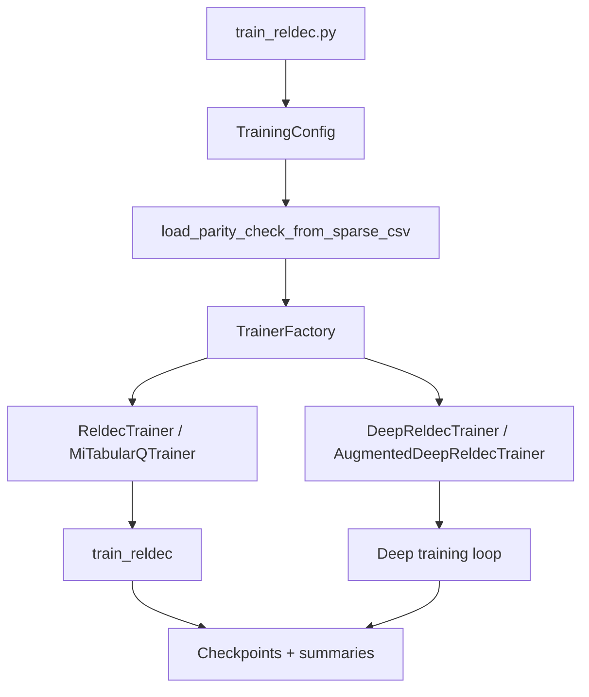
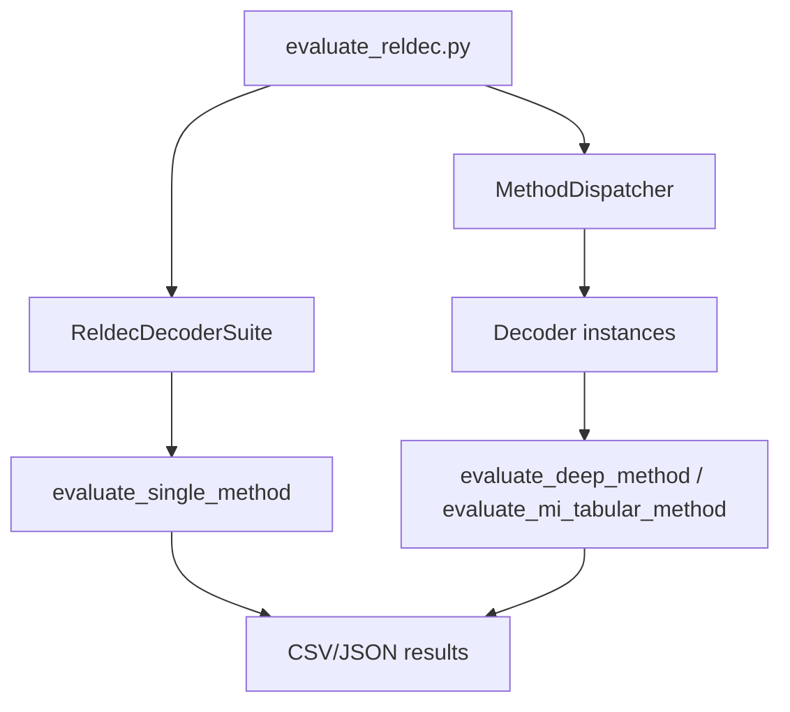

# Architecture

This document describes the current codebase structure and data flow using the code as the source of truth.

## High-level layout

- RELDEC/ - RELDEC training and evaluation package (algorithms, CLI entry points, utilities).
- ldpc/ - Local LDPC library (Cython extensions + Python wrappers) used by RELDEC.
- RL/ - Separate reinforcement learning experiments and environments.
- utils/, matrices/, newmatrix/, newmatrix2/, pc_matrices/ - supporting data and utilities.

## RELDEC package map

Core package entry points and responsibilities:

- RELDEC/algorithms/ - canonical algorithm implementations.
  - reldec_core.py - tabular RELDEC, checkpoint helpers, decoder suite, code presets.
  - reldec_deep.py - DQN trainers/decoders, MI baselines, MI tabular Q, deep checkpointing.
  - reldec_augmented.py - augmented DQN variants with extra state features.
  - reldec_global_mdp.py - full-state tabular MDP variant (hash-based Q table).
- RELDEC/interfaces/ - abstract base classes (Trainer, Policy, StateEncoder, ActionSpace, RewardFn, etc.).
- RELDEC/mdp/ - reusable MDP primitives (ClusterBinaryStateEncoder, ClusterActionSpace, MeanNeighborSignReward).
- RELDEC/registry.py - canonical method/policy catalogs and helpers.
- RELDEC/trainer_factory.py - creates trainers by policy type.
- RELDEC/method_dispatcher.py - maps evaluation methods to concrete decoders.
- RELDEC/evaluation_router.py - routes evaluation to the right evaluator.
- RELDEC/experiments/ - ExperimentSpec/EvaluationSpec + config loaders for YAML/JSON.
- RELDEC/storage.py - file-first persistence for run manifests.
- RELDEC/data_catalog.py - SQL-free query layer over manifests and CSV/JSON result files.
- RELDEC/context_sync.py - generates markdown summaries from registries and run store.
- RELDEC/train_reldec.py - training CLI entry point.
- RELDEC/evaluate_reldec.py - evaluation CLI entry point.
- RELDEC/smoke_run.py - small 2-episode tabular smoke test.
- RELDEC/jobs/query_results.py - CLI for querying stored runs/results without SQL.
- RELDEC/jobs/plot_results.py - plotting CLI built on the same file-based catalog.

RELDEC/algorithms/__init__.py re-exports the canonical algorithm surface for convenience.

## Algorithms and method families

Defined in RELDEC/registry.py and implemented in RELDEC/algorithms/:

- Baselines: flooding, random, round_robin (ReldecDecoderSuite in reldec_core.py).
- Tabular RELDEC: z=1 cluster scheduling with Q table (ReldecTrainer).
- Deep RELDEC: DQN-based trainers/decoders for z=1, z=2, and dynamic z (DeepReldecTrainer/DeepReldecDecoder).
- MI naive: greedy MI-based scheduling (MiReldecBaselineDecoder).
- MI tabular: MI-bin tabular Q learning + decoder (MiTabularQTrainer/MiTabularQDecoder).
- MI DQN: DQN variants with MI state (DeepReldecTrainer with mi_ policy labels).
- Augmented deep: continuous augmented feature added to DQN state (AugmentedDeepReldecTrainer/Decoder).
- Global MDP: full hard-decision state hashed for tabular Q (FullStateBinaryTabularTrainer).

## Data flow: training

Training is centered in RELDEC/train_reldec.py and RELDEC/algorithms/reldec_core.py.

1. CLI parsing and config merge (ConfigLoader) -> TrainingConfig.
2. Load parity-check matrix (load_parity_check_from_sparse_csv).
3. Build SNR schedule (build_training_snr_schedule).
4. Instantiate trainer:
   - Tabular: ReldecTrainer or MiTabularQTrainer.
   - Deep: DeepReldecTrainer or AugmentedDeepReldecTrainer.
5. Train episodes and save checkpoints (.npz, .npy) in RELDEC/checkpoints/<code>/.

## Data flow: evaluation

Evaluation is orchestrated by RELDEC/evaluate_reldec.py.

1. CLI parsing and config merge (ConfigLoader).
2. Validate required artifacts (q_table, MI q_table, deep checkpoints).
3. Create MethodDispatcher and ReldecDecoderSuite.
4. Evaluate methods via EvaluationRouter.
5. Write CSV/JSON results (RELDEC/results/).

## Checkpoints and artifacts

- Tabular: q_table stored in .npz checkpoints, plus final .npy q_table.
- Deep: DQN checkpoints stored as compressed .npz with serialized torch state.
- Manifests: ExperimentSpec/EvaluationSpec captured in JSON (experiments/spec.py).
- RunStore (storage.py) records manifests and symlinks artifacts under RELDEC/runs/.
- Run identity: training and evaluation runs use a deterministic run id derived from a config hash (storage.compute_config_hash). This enables reuse of identical configurations and auto-resume to extend a run when episodes are incomplete.
- Query surface: the catalog scans manifests plus the result CSV/JSON files directly; plots are regenerated from the same rows instead of notebook state or ad hoc exports.

## Dependencies and runtime assumptions

- ldpc.bp_decoder.BpDecoder is the core decoder used by all algorithms (local ldpc package).
- numpy, scipy are required for all paths.
- torch is optional; deep and augmented methods require it.
- YAML configs require PyYAML (optional).
- Some modules import interfaces or utilities via package paths; ensure RELDEC is on PYTHONPATH when running scripts.

## Extending the system

Add a new method by:

1. Implementing it in RELDEC/algorithms/ (trainer and/or decoder).
2. Registering its method/policy name in RELDEC/registry.py.
3. Wiring it in MethodDispatcher (for evaluation) and TrainerFactory (for training).
4. Adding config keys in experiments/config.py if needed.

## Smoke test

RELDEC/smoke_run.py runs a 2-episode tabular training loop on the Mackay code to validate core wiring.
