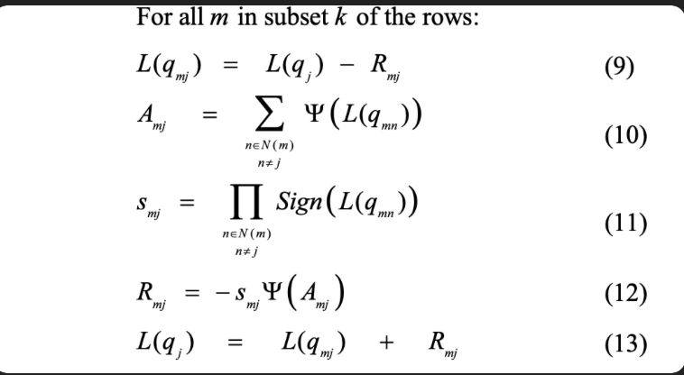
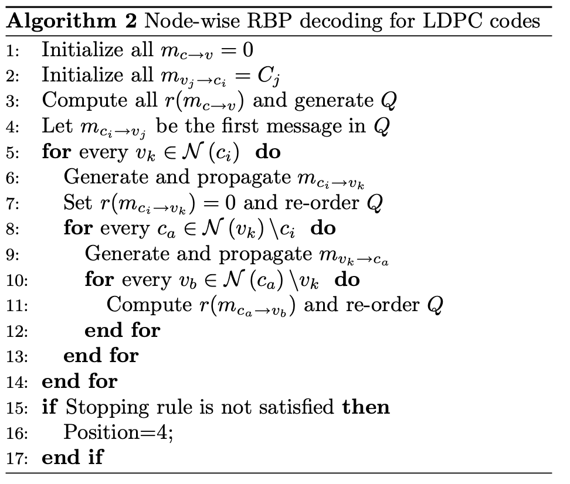

# Decoder Review

## Work done so far

- Implemented cluster decoder
- Tested Random decoding
- Tested RBP decoding

## Algo for cluster Decoder

I have taken this from the paper cited by matlab for layer decoder.
> Hocevar, D.E. "A reduced complexity decoder architecture via layered decoding of LDPC codes." In IEEE Workshop on Signal Processing Systems, 2004. SIPS 2004, 107-112.

I followed this algo as faithfully as i can, however I didnt quite understand eqn 13, so i replaced it with 

> L(q_j) += newR - oldR

Overall, the performance is promising even if not exactly matching with matlab.

|snr | Custom_rr (10000 frames) | Matlab (10000 frames) |
|:--- | :--- | :--- |
|-3| 0.1581| 0.1584|
|-2| 0.1294| 0.1299|
|-1| 0.1014| 0.1015|
|0| 0.0702| 0.0720|
|1| 0.0242| 0.0405|
|2| 0.0006| 0.0405|
|3| 8.23e-07| 0.0405|

## Algo for RBP

I for now implemented node-wise rbp as given in 'Informed Dynamic Scheduling for Belief-Propagation Decoding of LDPC Codes'.

I did this instead of cluster wise rbp because:

- I still have to expose the messages computed by backend to frontend.
- I want to check if the algorithm is replicable as said in the paper first before modifying it.

### Current Issues

Although i implemented this scheduling algorithm, it is taking a very long time. 

It is expected that this will take a lot longer than layered or flooding because of the complexity, but still the time taken is unreasonable and i have to optimise code still.

## Mutual Information based decoding

Some doubts regarding this. Needs to be clarified

## RL based decoding

Will have to expose the messages from backend to frontend.

After which, the decoder will be perfectly diliineated. Backend(cpp)-Bp algo, Frontend(python)-Scheduling

We (might) try to recreate RELDEC to begin with, will come with a timeline regarding the same by next meet.

## Timeline

### By next meet:

- Be done with exposing messages to frontend
- Implement cluster-wise rbp and MI based decoding
- Get a framework of RL and get its timeline decided

